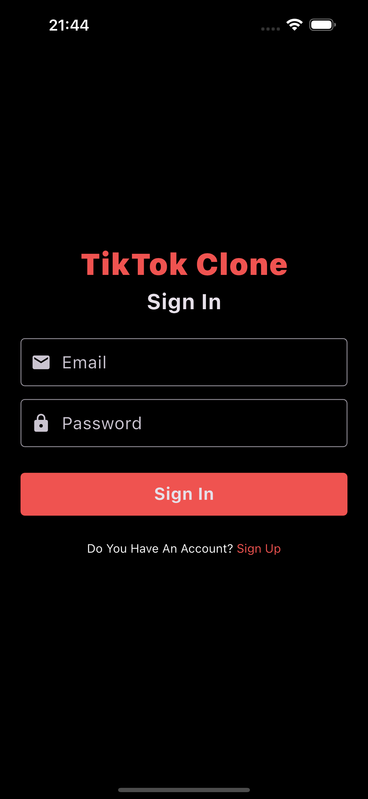
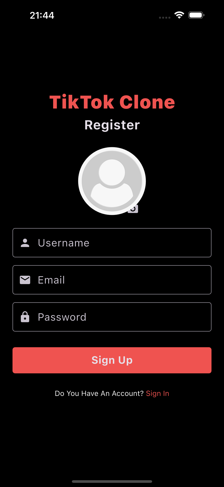
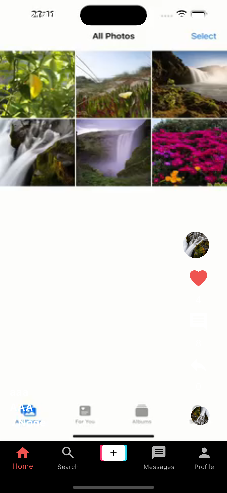
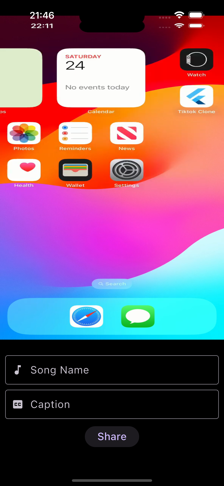
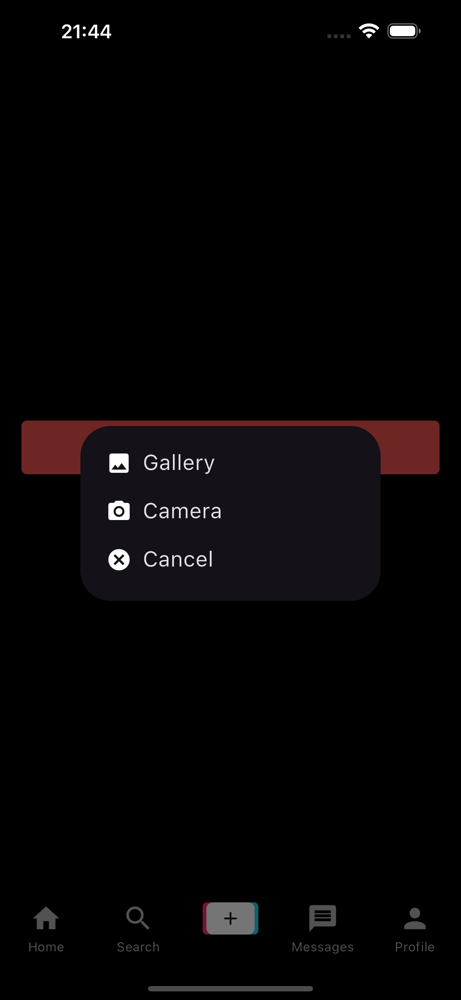
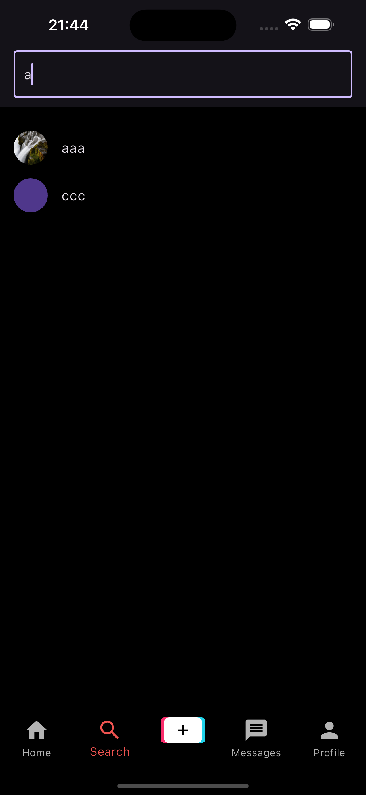
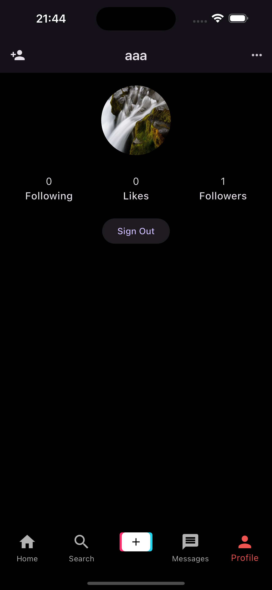

# TikTok Clone

This project was soooo hard.
Please use this application with patience because I have never written in Getx state management.
[reference link](https://www.youtube.com/watch?v=4E4V9F3cbp4)

## Table of Contents

- [Features](#features)
- [Screenshots](#screenshots)
- [Videos](#videos)
- [Installation](#installation)
- [Packages used](#packages-used)

## Features

- Sign in/Sign up
- Uploading Videos with Caption
- Compressing Videos
- Generating Thumbnails Out of Video
- Displaying Videos with Caption
- Liking on Posts
- Commenting on Posts
- Liking the Comments
- Searching Users
- Following Users
- Displaying Followers, Following, Likes
- TikTok Like UI

## Screenshots

  
  
  

  
  
  

  
  
  

  

## Videos

[Video on YouTube](https://youtu.be/ysfQUaQwFzI)

## Installation

After cloning this repository go to `tiktok-clone` folder. Then, follow the following steps:

- Create project in [firebase](https://firebase.google.com)
- Connect your firebase to the project

## Packages used

- get
- firebase_core
- firebase_auth
- firebase_storage:
- cloud_firestore
- image_picker
- video_player
- video_compress
